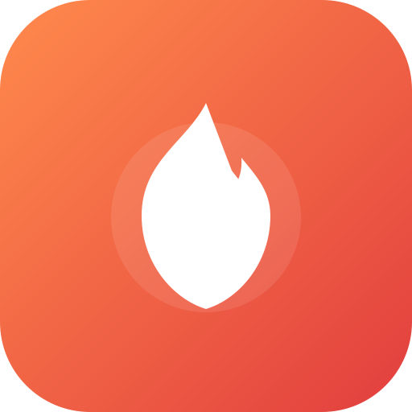
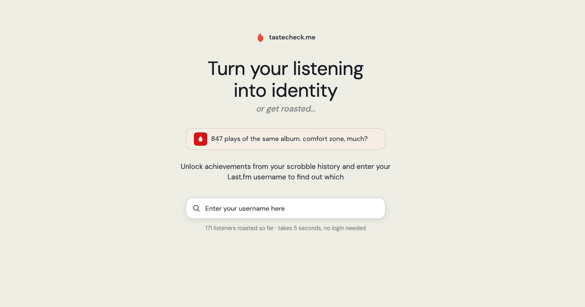
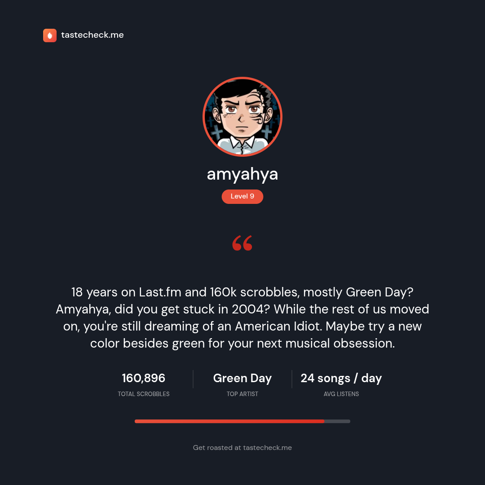

<p align="center">
  
</p>

<h1 align="center">tastecheck.me</h1>

<p align="center"><em>Turn your listening into identity</em></p>

Turn your Last.fm listening history into a gamified profile with unlock achievements, level up with XP, AI playful roasts, compare your taste with friends or jointly roast each other.

<table align="center">
  <tr>
    <td align="center">
      
    </td>
    <td align="center">
      
    </td>
  </tr>
</table>

## We're live

We just launched on Product Hunt and Peerlist. Come say hi, and an upvote is always appreciated if you like what we're building! 🎉

<p align="left">
  <a href="https://peerlist.io/ryanatefoods/project/tastecheckme" target="_blank" rel="noreferrer">
    
  </a>
  &nbsp;
  <a href="https://www.producthunt.com/products/tastecheck-me?embed=true&utm_source=badge-featured&utm_medium=badge&utm_campaign=badge-tastecheck-me" target="_blank" rel="noopener noreferrer">
    
  </a>
</p>

## Features

- **12 lifetime achievements** across three categories: scrobbles, unique artists, and profile completeness
- **10-level XP progression** earned from scrobbles, achievements (150 XP each), and unique artists
- **AI "Roast Me"**: a playful, opt-in roast of your listening habits (Gemini 2.5 Flash via OpenRouter)
- **Shareable roast cards**: turn a roast result into a downloadable/shareable image card, generated entirely client-side
- **Profile comparison**: a compatibility score, shared artists, and a joint roast for any two users
- **Design Responsive**: a warm paper canvas with a single ink + coral accent system and gamified badge components, see [DESIGN.md](DESIGN.md)

## Architecture

- **Backend**. FastAPI (Python) that proxies the Last.fm API and computes achievements and XP
- **Frontend**. vanilla HTML/CSS/JS, no build step, no frameworks, served as static files

## API

| Endpoint | Description |
|---|---|
| `GET /user/{username}` | Full profile: stats, achievements, XP, level |
| `GET /roast/{username}?consent=true` | AI roast of a user's listening habits |
| `GET /compare/{user1}/{user2}` | Compatibility score + shared artists |
| `POST /compare/roast` | Joint roast comparing two users |
| `GET /health`, `GET /ready` | Health / readiness checks |

## Setup

### Prerequisites

- Python 3.10+
- A [Last.fm API key](https://www.last.fm/api/account/create)

### Backend

```bash
cd backend
pip install -r requirements.txt
```

Create `backend/.env`:

```env
LASTFM_API_KEY=your_api_key_here
LASTFM_SHARED_SECRET=your_shared_secret_here

# Optional, enables the AI roast + compare roast features
LLM_API_KEY=your_openrouter_key_here
```

Start the server:

```bash
make serve          # or: uvicorn main:app --reload
```

The API runs at `http://localhost:8000`.

### Frontend

No build step. In development (`ENVIRONMENT=development`) the backend serves the frontend as static files; otherwise open `frontend/index.html` directly. The API base URL is configured in `frontend/config.js`.

## Project Structure

```
backend/
├── main.py          # FastAPI app + routes
├── achievements.py  # Achievement conditions, XP, level thresholds
├── lastfm.py        # Async Last.fm API client
├── llm.py           # AI roast (OpenRouter) + in-memory caching
├── config.py        # Environment variable loading
└── tests/           # Pytest suite

frontend/
├── index.html       # Main app (profile + dashboard)
├── compare.html     # Profile comparison
├── how-to.html      # Achievement guide
├── about.html       # About page
├── release.html     # Release notes / changelog
├── privacy.html     # Privacy policy
├── terms.html       # Terms of service
├── 404.html         # Not found page
├── app.js           # Main app logic + shareable roast card generation
├── compare.js       # Comparison logic
├── config.js        # Shared API base URL resolution
├── style.css        # Design tokens + styles
├── tracking.js      # Analytics
├── achievements-data.js
└── assets/          # Icons + images

e2e/                 # Playwright smoke tests
```

## Documentation

- [DESIGN.md](DESIGN.md): design system
- [LEVELS.md](LEVELS.md): XP thresholds and formulas
- [how-to.html](frontend/how-to.html): achievement unlock guide
- [release.html](frontend/release.html): release notes / changelog

## Contributing

Contributions are welcome. Before opening a pull request:

1. Fork the repository and create a focused feature or fix branch.
2. Keep changes scoped and follow the existing project conventions.
3. Run the relevant backend tests with `pytest`.
4. Update documentation when behavior or setup changes.
5. Open a pull request with a concise summary and testing notes.

For larger changes, open an issue first to discuss the proposed direction.

## License

This project is licensed under the [MIT License](LICENSE).