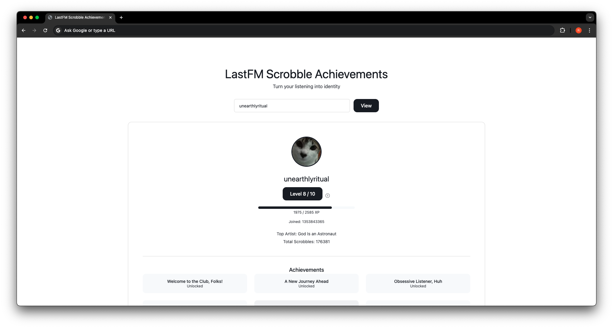
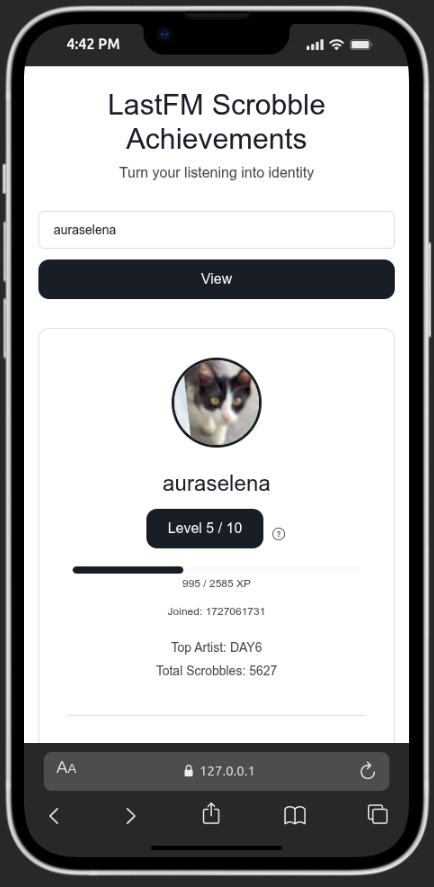

# Last.fm Scrobble Achievements

A web application that transforms Last.fm listening data into a gamified profile with 12 unlockable achievements and a 10-level progression system powered by XP

| Web Version | Mobile Version |
| -- | -- |
|  |  |

## Features

- **12 achievements** across three categories: scrobbles, unique artists, and profile completeness
- **10-level progression system** with XP earned from playcount, achievements, and artist diversity
- **Visual progress bar** showing overall progress toward Level 10
- **Locked achievement display** showing all achievements with enabled/disabled states
- **Responsive design** following an Airtable-inspired editorial design system

## Architecture

### Backend

FastAPI server that proxies Last.fm API data and computes achievements and XP levels

| File | Purpose |
|---|---|
| `backend/main.py` | FastAPI app, single endpoint `/user/{username}` |
| `backend/achievements.py` | Achievement conditions, XP calculation, level thresholds |
| `backend/lastfm.py` | Async Last.fm API client (user info, top artists, recent tracks) |
| `backend/config.py` | Environment variable loading for API credentials |

### Frontend

Static single-page application with no build step or using third-party frameworks (for now...)

| File | Purpose |
|---|---|
| `frontend/index.html` | Page structure, profile card, achievement grid |
| `frontend/style.css` | Design tokens, layout, component styles, responsive breakpoints |
| `frontend/app.js` | Fetch API data, render profile, achievements, and progress bar |

## API Reference

### GET `/user/{username}`

Returns the full profile data for a given Last.fm username.

#### Response

```json
{
  "username": "string",
  "total_scrobbles": 12345,
  "top_artist": "string",
  "achievements": [
    { "name": "string", "unlocked": true }
  ],
  "level": 5,
  "current_xp": 775,
  "max_xp": 2585,
  "progress_pct": 30.0,
  "profile_image": "string (URL)",
  "joined_date": "string (unix timestamp)"
}
```

## XP System

Total max XP is 2,585, distributed across five sources:

| Source | Max XP | Description |
|---|---|---|
| Scrobbles | 785 | Cumulative milestones from playcount (1 to 1,000,000) |
| Achievements | 1,500 | 150 XP per unlocked achievement (10 total) |
| Unique Artists | 300 | Cumulative milestones from unique artist count (50 to 1,000) |

You may refer to the [LEVELS.md](LEVELS.md) for complete threshold tables, formulas, and example calculations.

## AI Roast (beta)

The app can generate a playful, AI-powered roast (powered by Google Gemini 3.5 Flash) of a user's listening habits. Before the roast is shown, an in-page consent gate asks the user to opt in. The roast is generated via [OpenRouter](https://openrouter.ai/) (third-party LLM API) and cached in memory for 24 hours per username (roast counter resets on server restart) to reduce API calls and improve response times. Each Last.fm username gets 3 roasts: cached responses don't count against the limit. If the roast is unavailable, the AI may be rate-limited and you must try again later.

To enable the feature, add an optional API key to your `.env`. Note that your OpenRouter key needs billing enabled (the free tier is not sufficient):

```
LLM_API_KEY=your_openrouter_key_here
```

The endpoint is `GET /roast/{username}?consent=true` and returns:

```json
{
  "username": "string",
  "roast": "string",
  "cached": false
}
```

## Achievements

### Scrobbles

| Achievement | Condition |
|---|---|
| Welcome to the Club, Folks! | 1+ total scrobbles |
| A New Journey Ahead | 1,000+ total scrobbles |
| Obsessive Listener, Huh | 10,000+ total scrobbles |
| Even AI Can't Stop Me | 100,000+ total scrobbles |
| No Life? Pure Life | 1,000,000+ total scrobbles |

### Unique Artists

| Achievement | Condition |
|---|---|
| Your Loved Ones | 1+ unique top artists |
| Explorer | 100+ unique top artists |
| How About Touch Some Grass? | 1,000+ unique top artists |
| Are You an Elitist or Identity Crisis? | 5,000+ unique top artists |
| LGTM | 10,000+ unique top artists |

### Profile

| Achievement | Condition |
|---|---|
| Spotify Wasn't Even Born Yet | Account registered 10+ years ago |
| The Completion | Profile has a real name, profile image, and country set |

## Setup

### Prerequisites

- Python 3.10+
- A Last.fm API key (register at https://www.last.fm/api/account/create)

### Backend

1. Navigate to the backend directory:

```
cd backend
```

2. Install dependencies:

```
pip install -r requirements.txt
```

3. Create a `.env` file with your Last.fm credentials:

```
LASTFM_API_KEY=your_api_key_here
LASTFM_SHARED_SECRET=your_shared_secret_here

# Optional: enables the AI roast feature
LLM_API_KEY=your_openrouter_key_here
```

4. Start the server:

```
uvicorn main:app --reload
```

Or you can use command from `Makefile`:

```
make serve
```

The API will be available at `http://localhost:8000` and to open the client-side you need to copy from the HTML path

### Frontend

The frontend is a static application. Open `frontend/index.html` directly in a browser, or serve it with any static file server. The API base URL is configured at the top of `frontend/app.js` and defaults to `http://localhost:8000`

For development with CORS already enabled on the backend, no additional server is required — just open the HTML file in a browser.

## Design System

The UI follows an Airtable-inspired editorial design system documented in [DESIGN.md](DESIGN.md). Key characteristics:

- White canvas background with dark ink type
- Near-black primary CTA with white text
- Hairline borders instead of shadows for depth
- 4px-based spacing system
- Inter Display font family
- Flat, zero-shadow elevation model

## Project Structure

```
lastfm-achievements/
├── backend/
│   ├── .env                  # LastFM API credentials (not tracked)
│   ├── config.py             # Environment configuration
│   ├── main.py               # FastAPI application
│   ├── achievements.py       # XP logic and achievement conditions
│   └── lastfm.py             # Last.fm API client
├── frontend/
│   ├── index.html            # Page markup
│   ├── style.css             # Styles and design tokens
│   └── app.js                # Client-side logic
├── DESIGN.md                 # Design system documentation
├── LEVELS.md                 # XP system documentation
└── README.md                 # Project documentation
```
